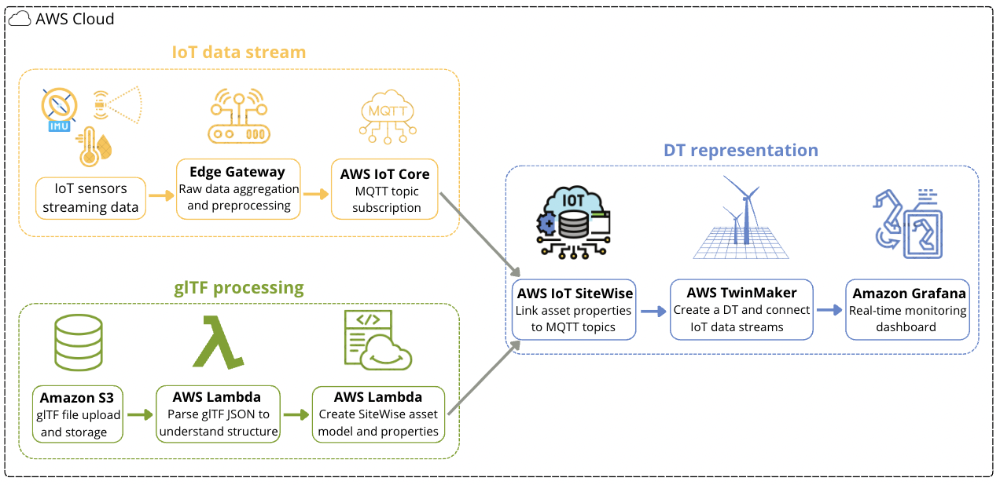

# AWS CLoud Development Kit ingesting glTF assets and linking them to IoT sensors.

## Automated pipeline using AWS IoT Core, IoT SiteWise, TwinMaker and Grafana to get a Digital Twin updated in real-time with IoT streams data.


This project automatically converts glTF 3D models into fully functional digital twins with real-time IoT sensor integration. Upload your own glTF file and gets its live digital twin with automated asset hierarchy creation in AWS IoT SiteWise and visualization in Grafana.

## Project Architecture



## Deployment on your AWS account

### Prerequisites

- AWS CLI configured with appropriate permissions
- Python 3.11+
- Node.js 18+ (for CDK)
- AWS CDK CLI installed globally: `npm install -g aws-cdk`

### Step 1: Clone and Setup

Clone the repository and navigate to it:

```bash
git clone https://github.com/tesscln/gltf-iot-sensors-aws.git
cd gltf-iot-sensors-aws
```

Create and activate a virtual environment:

```bash
python3 -m venv .venv
source .venv/bin/activate
```

Install the required dependencies:

```bash
pip install -r requirements.txt
```

### Step 2: Deploy the Infrastructure

Run this in your terminal:

```bash
cdk deploy
```

This creates:
- ✅ S3 bucket for the glTF files uploads
- ✅ Lambda function triggered for automatic processing
- ✅ IoT Core MQTT broker and topic rules
- ✅ TwinMaker workspace
- ✅ IoT SiteWise setup (asset model and assets)
- ✅ All necessary IAM roles and permissions


### Step 3: Upload Your glTF File

Run this in your terminal:

```bash
python3 scripts/upload_gltf.py --bucket-output-name GltfUploadBucketName
```

The upload script supports both glTF formats:
- **`.glb` files**: Single binary file (self-contained)
- **`.gltf` + `.bin` files**: JSON file with external binary data

The script will prompt you to choose your format and provide the file paths accordingly. For `.gltf` + `.bin` files, it will ask for the `.gltf` file path first, then the `.bin` file path.

If the upload is successful, you'll see: **"Upload complete. Lambda function will process the new assets."**

### Step 4: Lambda function gets triggered and starts building the pipeline.

1. **Automatic Trigger**: Lambda function is automatically triggered by the S3 glTF upload.
2. **Structure Parsing**: Lambda extracts scene, nodes, mesh names, and sensor locations from your glTF file.
3. **Asset Creation**: IoT SiteWise assets and hierarchies are created automatically.
4. **Topic Mapping**: Each asset property is mapped to its corresponding MQTT topic.
5. **Digital Twin Binding**: TwinMaker connects the 3D model to the IoT asset hierarchy.

### Step 5: Visualize in Grafana

1. Access your Grafana dashboard
2. View the live TwinMaker 3D scene
3. See real-time sensor data streaming
4. Query historical data from Timestream or S3

### Cleanup

To remove all created resources (assets, asset models, and uploaded glTF files), run:

```bash
python3 scripts/cleanup_all.py
```

This will delete all IoT SiteWise assets, asset models, and glTF files from S3, allowing you to start fresh.

## Project Repository Structure

```
gltf-iot-sensors-aws/
├── app.py                          # CDK app entry point
├── requirements.txt                # Python dependencies
├── requirements-dev.txt            # Development dependencies
├── cdk.json                        # CDK configuration
├── scripts/                       
│   └── upload_gltf.py              # glTF file upload script
├── project_code/                   
│   ├── __init__.py               
│   ├── project_code_stack.py       # CDK stack definition
│   └── lambda/                     # Lambda functions code
│       └── parse_gltf.py           # Main Lambda handler parsing the glTF
├── tests/                          # Unit tests
│   └── unit/
│       └── test_project_code_stack.py
├── images/                         # Project images and diagrams
└── .venv/                          # Virtual environment (not in git)
```

### Useful CDK Commands

```bash
cdk ls                    # List all stacks
cdk synth                 # Generate CloudFormation template
cdk deploy                # Deploy to AWS
cdk diff                  # Compare with deployed stack
cdk destroy               # Clean up all resources
cdk docs                  # Open CDK documentation
```

## Troubleshooting Common Issues

1. **Upload Fails**: Check S3 bucket permissions and file size limits
2. **Lambda Timeout**: Increase timeout in `project_code_stack.py`
3. **Memory Issues**: Increase memory allocation for large glTF files
4. **SiteWise Errors**: Verify IoT SiteWise service is enabled in your region

### CloudWatch Logs

Lambda execution logs are available in CloudWatch:
- Log Group: `/aws/lambda/<stack-name>-GltfParserLambda`
- Retention: 1 week (configurable)

## Contributing

1. Fork the repository
2. Create a feature branch
3. Make your changes
4. Add tests for new functionality
5. Submit a pull request

## License

This project is licensed under the MIT License - see the [LICENSE](LICENSE) file for details.


